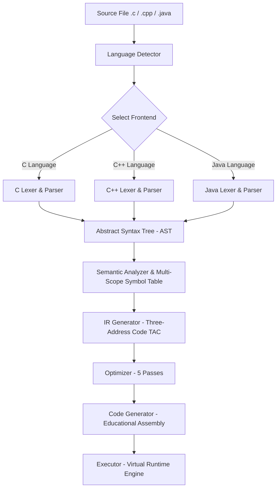

# PolyCompile

## Project Summary

**PolyCompile** is a multi-language compiler framework designed and implemented in C++ (with Flex & Bison for standalone parser deliverables). It compiles subsets of three major programming languages—**C**, **C++**, and **Java**—through an end-to-end 6-phase compilation architecture: Lexical Analysis, Syntax Analysis, Semantic Analysis, Intermediate Code Generation (Three-Address Code - TAC), TAC Optimization (5 distinct pass algorithms), and Target Assembly Code Generation accompanied by an interactive Virtual Execution Engine (Executor). Additionally, PolyCompile features an integrated web-based IDE (Node.js/Express with Monaco Editor frontend) for code editing, real-time compilation, and visual pipeline inspection.

---

## Motivation

Understanding compiler design requires practical experience with lexical tokenization, context-free grammars, abstract syntax tree construction, type resolution, intermediate code linearization, optimization strategies, and runtime execution. PolyCompile was built to provide a hands-on compiler platform that demonstrates how distinct language syntaxes (procedural C, stream-oriented C++, and class-based Java) can be ingested by specialized frontends and funneled into a common Intermediate Representation (IR), optimization pipeline, and virtual runtime environment.

---

## Feature Summary

- **Multi-Language Frontends**: Dedicated lexers, parsers, symbol tables, and semantic analyzers for **C** (`.c`), **C++** (`.cpp`), and **Java** (`.java`).
- **Dual-Frontend Architecture**:
  - **Standalone Flex & Bison Parsers**: Lab deliverables (`test_c.exe`, `test_cpp.exe`, `test_java.exe`) built directly from `.l` and `.y` specifications.
  - **Unified Compiler CLI**: Integrated C++ pipeline (`polycompile` / `polycompile.exe`) supporting extension-based language detection and unified IR processing.
- **Complete 6-Phase Pipeline**:
  1. Lexical Analysis (Tokenization & Position Tracking)
  2. Syntax Analysis (AST Construction & Parse Tree Generation)
  3. Semantic Analysis (Type Checking, Scope Resolution, Variable Redeclaration/Undeclared Checking)
  4. Intermediate Code Generation (Three-Address Code - TAC)
  5. Code Optimization (5 Optimization Passes)
  6. Target Code Generation & Execution (Educational Assembly Emission & Virtual Runtime Execution)
- **5 Optimization Passes**: Constant Folding, Constant Propagation, Copy Propagation, Algebraic Simplification, and Dead Code Elimination.
- **Visual Pipeline Inspection**: CLI flags (`--debug`, `--tokens`, `--ast`, `--symbol-table`, `--tac`, `--opt`, `--asm`) and formatted artifact exports in `output/`.
- **Integrated Web IDE**: Full-stack web interface (`server/`) with code editing (Monaco Editor), live stdout execution, and visual breakdown of compiler phases.

---

## Compiler Pipeline



---

## Technologies Used

| Category | Technology | Usage / Description |
|----------|------------|---------------------|
| **Core Compiler Language** | C++ (C++11/C++14) | Main compiler infrastructure, IR, optimizer, code generator, executor |
| **Lexer & Parser Generators** | Flex (v2.6+) & Bison (v3.0+) | Lexical tokenization (`.l`) and LALR(1) parsing (`.y`) specifications |
| **Build System** | GNU Make, GCC / MinGW (`g++`) | Cross-platform build automation via `Makefile` |
| **Backend Web Server** | Node.js, Express.js | Web IDE backend serving compilation API and executing compiler binaries |
| **Frontend Web Stack** | HTML5, CSS3, Vanilla JS, Monaco Editor | Browser-based code editor and compiler visual debugging UI |
| **Containerization** | Docker | Containerized compilation environment (`Dockerfile`) |

---

## Project Structure

```
PolyCompile/
├── main.cpp                         # CLI entry point and main pipeline driver
├── Makefile                         # Build targets for PolyCompile and Flex/Bison test binaries
├── Dockerfile                       # Container definition for building & running PolyCompile
├── README.md                        # Project documentation
├── LICENSE                          # MIT License
│
├── compiler/                        # Core compiler source code
│   ├── common/                      # Common pipeline components
│   │   ├── Token/
│   │   │   └── Token.hpp            # TokenType enum and Token structure definition
│   │   ├── Utilities/
│   │   │   ├── ASTBase.hpp          # Unified AST node structures and hierarchy
│   │   │   ├── ASTParser.hpp        # String-to-AST parsing helpers
│   │   │   ├── DiagnosticEngine.hpp # Centralized diagnostic error and warning logger
│   │   │   └── FileReader.hpp       # Safe source file reading helper
│   │   ├── LanguageDetector/
│   │   │   └── LanguageDetector.hpp # Extension-based language identifier (.c, .cpp, .java)
│   │   ├── IR/
│   │   │   ├── IRGenerator.hpp      # TAC IR generator header
│   │   │   └── IRGenerator.cpp      # AST traversal and TAC instruction emission
│   │   ├── Optimizer/
│   │   │   ├── Optimizer.hpp        # Optimization pass manager header
│   │   │   └── Optimizer.cpp        # Constant folding, propagation, simplification, DCE passes
│   │   ├── CodeGen/
│   │   │   ├── CodeGenerator.hpp    # Educational assembly emission header
│   │   │   └── CodeGenerator.cpp    # TAC-to-Assembly translator
│   │   └── Executor/
│   │       ├── Executor.hpp         # Virtual machine executor header
│   │       └── Executor.cpp         # Runtime assembly execution and output simulation
│   │
│   ├── c/                           # C Language Frontend
│   │   ├── lexer/lexer_c.l          # Flex specification for C tokens
│   │   ├── parser/parser_c.y        # Bison grammar specification for C
│   │   ├── ast/AST_C.hpp            # C-specific AST types
│   │   ├── symbol_table/SymbolTable_C.hpp # Scope-managed symbol table for C
│   │   ├── semantic/Semantic_C.hpp/.cpp   # Semantic checks for C
│   │   └── frontend/Frontend_C.hpp/.cpp   # C frontend manager
│   │
│   ├── cpp/                         # C++ Language Frontend
│   │   ├── lexer/lexer_cpp.l        # Flex specification for C++ tokens
│   │   ├── parser/parser_cpp.y      # Bison grammar specification for C++
│   │   ├── ast/AST_CPP.hpp          # C++-specific AST types
│   │   ├── symbol_table/SymbolTable_CPP.hpp # Scope-managed symbol table for C++
│   │   ├── semantic/Semantic_CPP.hpp/.cpp   # Semantic checks for C++
│   │   └── frontend/Frontend_CPP.hpp/.cpp   # C++ frontend manager
│   │
│   └── java/                        # Java Language Frontend
│       ├── lexer/lexer_java.l       # Flex specification for Java tokens
│       ├── parser/parser_java.y     # Bison grammar specification for Java
│       ├── ast/AST_Java.hpp         # Java-specific AST types
│       ├── symbol_table/SymbolTable_Java.hpp # Scope-managed symbol table for Java
│       ├── semantic/Semantic_Java.hpp/.cpp   # Semantic checks for Java
│       └── frontend/Frontend_Java.hpp/.cpp   # Java frontend manager
│
├── examples/                        # Suite of test source files (.c, .cpp, .java)
│   ├── hello.c, add.c, sub.c, function.c, for.c, while.c, ifelse.c, switch.c, nested_loop.c
│   ├── hello.cpp, arithmetic.cpp, for.cpp, while.cpp, ifelse.cpp, switch.cpp
│   └── Hello.java, Arithmetic.java, ForLoop.java, WhileLoop.java, IfElse.java, SwitchCase.java
│
├── server/                          # Web IDE Node.js/Express application
│   ├── server.js                    # Express backend server with execution APIs
│   ├── index.html                   # Web UI structure
│   ├── style.css                    # Web UI styling
│   └── script.js                    # Monaco Editor integration and API logic
│
└── output/                          # Directory for generated compiler artifacts
    ├── tokens.txt                   # Lexical analysis output
    ├── ast.txt                      # Abstract Syntax Tree dump
    ├── symbol_table.txt             # Symbol Table state
    ├── semantic_report.txt          # Semantic analysis diagnostics
    ├── tac.txt                      # Generated Three-Address Code
    ├── optimized_tac.txt            # TAC post-optimization
    └── target_code.asm              # Generated educational assembly
```

---

## Build Instructions

### Prerequisites
- **GCC / MinGW**: `g++` with C++11 support or higher.
- **GNU Make**: `make` or `mingw32-make`.
- **Flex & Bison** (Optional, required only for building Flex/Bison test binaries): `flex` and `bison`.
- **Node.js** (Optional, required for web IDE): `node` and `npm`.

### Building PolyCompile CLI

```bash
# On Linux / macOS / MSYS2
make all

# On Windows PowerShell / CMD (using MinGW)
mingw32-make win
# or
make win
```

### Building Standalone Flex & Bison Parsers

```bash
# Build all standalone parser test executables (test_c.exe, test_cpp.exe, test_java.exe)
make fb-all
```

### Building Containerized App (Docker)

```bash
docker build -t polycompile .
docker run -it -p 3000:3000 polycompile
```

---

## Run Instructions

### Running PolyCompile CLI

```bash
# Execute a C program
./polycompile examples/hello.c

# Execute a C++ program
./polycompile examples/hello.cpp

# Execute a Java program
./polycompile examples/Hello.java
```

### Running Standalone Flex & Bison Executables

```bash
# C Parser Test
./test_c.exe examples/for.c

# C++ Parser Test
./test_cpp.exe examples/switch.cpp

# Java Parser Test
./test_java.exe examples/Arithmetic.java
```

### Running Web IDE Server

```bash
cd server
npm install
node server.js
```
Open a browser and navigate to `http://localhost:3000`.

---

## Usage Instructions

```
Usage: polycompile [flags] <source_file>
```

### Command Line Flags

| Flag | Description |
|------|-------------|
| *(none)* | Compile input file, optimize TAC, emit assembly, and run Virtual Machine execution. |
| `--debug` | Display detailed phase-by-phase execution report (Tokens, AST, TAC, Assembly, Virtual Execution). |
| `--tokens` | Output token stream generated during lexical analysis. |
| `--ast` | Output ASCII Abstract Syntax Tree representation. |
| `--symbol-table` | Output Symbol Table showing declared identifiers, types, and scopes. |
| `--tac` | Output unoptimized Three-Address Code IR instructions. |
| `--opt` | Output TAC instructions after running optimization passes. |
| `--asm` | Output target educational assembly code. |
| `--help`, `-h` | Display usage instructions and available command-line flags. |

---

## Example Commands

```bash
# 1. Normal Compilation & Virtual Execution
./polycompile examples/hello.c
./polycompile examples/arithmetic.cpp
./polycompile examples/ForLoop.java

# 2. Verbose Debug Pipeline Inspection
./polycompile --debug examples/hello.c
./polycompile --debug examples/SwitchCase.java

# 3. Individual Phase Inspections
./polycompile --tokens examples/hello.c
./polycompile --ast examples/hello.cpp
./polycompile --symbol-table examples/Hello.java
./polycompile --tac examples/ifelse.c
./polycompile --opt examples/ifelse.c
./polycompile --asm examples/for.cpp

# 4. Multi-Flag Combined Inspection
./polycompile --tokens --ast --tac examples/hello.c
./polycompile --tac --opt --asm examples/Arithmetic.java
```

---

## Supported Language Features

| Feature Category | C Subset (`.c`) | C++ Subset (`.cpp`) | Java Subset (`.java`) |
|------------------|------------------|----------------------|-----------------------|
| **Data Types** | `int`, `float`, `double`, `char`, `bool`, `void` | `int`, `float`, `double`, `char`, `bool`, `string`, `void` | `int`, `float`, `double`, `char`, `boolean`, `String`, `void` |
| **Control Flow** | `if`, `if-else`, `while`, `do-while`, `for`, `switch`/`case`/`default`, `break`, `continue` | `if`, `if-else`, `while`, `do-while`, `for`, `switch`/`case`/`default`, `break`, `continue` | `if`, `if-else`, `while`, `do-while`, `for`, `switch`/`case`/`default`, `break`, `continue` |
| **Input / Output** | `printf()`, `scanf()` | `std::cout <<`, `std::cin >>` | `System.out.println()`, `System.out.print()`, `Scanner` |
| **Program Structure** | `#include <stdio.h>`, global/local scope, functions, `return` | `#include <iostream>`, `using namespace std;`, functions, `return` | `public class ClassName`, `public static void main(String[] args)`, static methods |
| **Operators** | Arithmetic (`+`, `-`, `*`, `/`, `%`), Relational (`==`, `!=`, `<`, `>`, `<=`, `>=`), Logical (`&&`, `||`, `!`), Assignment (`=`) | Arithmetic (`+`, `-`, `*`, `/`, `%`), Relational (`==`, `!=`, `<`, `>`, `<=`, `>=`), Logical (`&&`, `||`, `!`), Assignment (`=`) | Arithmetic (`+`, `-`, `*`, `/`, `%`), Relational (`==`, `!=`, `<`, `>`, `<=`, `>=`), Logical (`&&`, `||`, `!`), Assignment (`=`) |

---

## Current Limitations

The current implementation of PolyCompile focuses on core educational compiler concepts. The following language constructs are **Not Implemented**:

1. **Pointers & Reference Types**: Pointer declarations (`*`), dereferencing, address-of (`&`), and reference parameters are *Not Implemented*.
2. **Derived & User-Defined Data Structures**: `struct`, `union`, `enum`, dynamic arrays, and multi-dimensional arrays are *Not Implemented*.
3. **Object-Oriented Programming (OOP)**: Class inheritance, polymorphism, virtual function tables (`vtable`), access modifiers (`public`/`private`/`protected`), constructor/destructor resolution, interfaces, and generics are *Not Implemented*.
4. **Preprocessor Expansion**: Macro expansions (`#define`), conditional compilation (`#ifdef`), and header file inclusion parsing are *Not Implemented* (headers are recognized lexically and skipped or checked basic syntactically).
5. **Exception Handling**: `try`, `catch`, `throw`, and stack unwinding mechanism are *Not Implemented*.
6. **Dynamic Memory Allocation**: `malloc()`, `free()`, `new`, and `delete` operators are *Not Implemented*.
7. **Complex Nested Control Flow Codegen**: Direct TAC generation from complex nested multi-level loops is simplified to primary block expressions in the current IR generator.

---

## Future Improvements

1. **Complete AST Codegen Translation**: Extend the IR generator to support complete multi-level nested loops, recursive user-defined function calls, and pointer arithmetic.
2. **Object-Oriented IR Extensions**: Add struct/class field offset lookup tables and dynamic dispatch mechanisms for object-oriented C++ and Java subsets.
3. **Native Backend Target**: Replace or augment the educational assembly translator with native x86_64 or LLVM IR code emission.
4. **Enhanced Diagnostic UI**: Integrate line-by-line syntax and semantic error underlining directly inside the web IDE Monaco editor canvas.
5. **Automated Compiler Test Harness**: Build an automated continuous integration script to validate token, parse tree, TAC, and output equivalence across all example files.

---

## Team Information

| Team Member | Student ID |
|-------------|------------|
| Ahmed Fairuz Anika | 231-115-161 |
| Tushar Sarker | 231-115-171 |
| Shongeet Saha | 231-115-189 |
