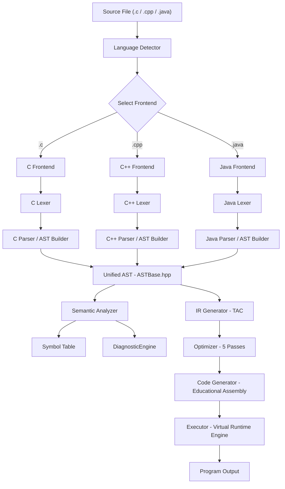
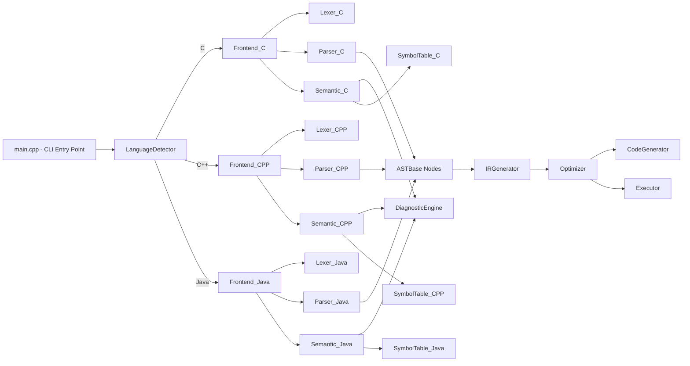

# Compiler Architecture — PolyCompile

---

## 1. Overview

PolyCompile is a multi-language educational compiler implemented in C++ (C++11/C++14). It processes source files written in three languages — **C**, **C++**, and **Java** — through a unified 6-phase pipeline that produces educational assembly output and executes it in a virtual machine.

---

## 2. Overall Compiler Pipeline



---

## 3. Phase Descriptions

### Phase 1 — Lexical Analysis
- **Tool**: Flex (`.l` specification files) + custom C++ hand-written lexer
- **Input**: Raw source file characters
- **Output**: `std::vector<Token>` — each Token carries `type`, `lexeme`, `line`, `column`
- **Files**: `lexer_c.l`, `lexer_cpp.l`, `lexer_java.l`; `Token.hpp`

### Phase 2 — Syntax Analysis
- **Tool**: Bison (`.y` grammar files) + custom C++ recursive descent parser
- **Input**: Token stream
- **Output**: `ASTNodePtr` (shared_ptr to the root `ProgramNode`)
- **Files**: `parser_c.y`, `parser_cpp.y`, `parser_java.y`; `ASTBase.hpp`

### Phase 3 — Semantic Analysis
- **Input**: AST root
- **Output**: Populated Symbol Table; diagnostic error list
- **Checks**: Duplicate variable declarations, undeclared variable usage, duplicate function declarations, undeclared function calls, parameter type recording
- **Files**: `Semantic_C.cpp`, `Semantic_CPP.cpp`, `Semantic_Java.cpp`; `DiagnosticEngine.hpp`

### Phase 4 — Intermediate Code Generation
- **Input**: AST root
- **Output**: `std::vector<TACInstruction>` (Three-Address Code)
- **IR Type**: Three-address code with temporary variables (`t0`, `t1`, ...) and labels (`L0`, `L1`, ...)
- **File**: `IRGenerator.cpp` / `IRGenerator.hpp`

### Phase 5 — TAC Optimization
- **Input**: Unoptimized TAC instruction list
- **Output**: Optimized TAC instruction list
- **Passes** (applied in order):
  1. Constant Folding
  2. Constant Propagation
  3. Copy Propagation
  4. Algebraic Simplification
  5. Dead Code Elimination
- **File**: `Optimizer.cpp` / `Optimizer.hpp`

### Phase 6 — Target Code Generation & Execution
- **CodeGenerator**: Translates optimized TAC → educational assembly (`LOAD`, `STORE`, `ADD`, `SUB`, `MUL`, `DIV`, `CMP`, `JMP`, `CALL`, `RET`, `PRINT`, `READ`)
- **Executor**: Interprets the TAC directly in a virtual machine with a `std::map<string, string>` register/variable store
- **Files**: `CodeGenerator.cpp`, `Executor.cpp`

---

## 4. Module Interaction Map



---

## 5. Directory Layout

```
PolyCompile/
├── main.cpp                  ← CLI entry point, pipeline coordinator
├── Makefile                  ← Build automation
├── compiler/
│   ├── common/               ← Shared backend (language-agnostic)
│   │   ├── Token/Token.hpp
│   │   ├── Utilities/ASTBase.hpp, DiagnosticEngine.hpp, FileReader.hpp, ASTParser.hpp
│   │   ├── LanguageDetector/LanguageDetector.hpp
│   │   ├── IR/IRGenerator.hpp, IRGenerator.cpp
│   │   ├── Optimizer/Optimizer.hpp, Optimizer.cpp
│   │   ├── CodeGen/CodeGenerator.hpp, CodeGenerator.cpp
│   │   └── Executor/Executor.hpp, Executor.cpp
│   ├── c/                    ← C language frontend
│   │   ├── lexer/lexer_c.l
│   │   ├── parser/parser_c.y
│   │   ├── ast/AST_C.hpp
│   │   ├── symbol_table/SymbolTable_C.hpp
│   │   ├── semantic/Semantic_C.hpp, Semantic_C.cpp
│   │   └── frontend/Frontend_C.hpp, Frontend_C.cpp
│   ├── cpp/                  ← C++ language frontend
│   └── java/                 ← Java language frontend
├── examples/                 ← Test source files
├── server/                   ← Web IDE (Node.js/Express + Monaco Editor)
└── output/                   ← Generated compilation artifacts
```

---

## 6. Key Design Decisions

| Decision | Rationale |
|----------|-----------|
| Unified `ASTBase.hpp` for all languages | All three frontends produce the same AST node types, allowing the backend (IR, Optimizer, CodeGen, Executor) to be completely language-agnostic |
| `shared_ptr<ASTNode>` (ASTNodePtr) | Safe memory management; avoids raw pointer leaks during AST traversal |
| Separate Flex/Bison parsers per language | Each language has substantially different syntax; separate grammars prevent conflict explosion |
| Static method design for Optimizer/CodeGenerator | No instance state needed; pass-based functional transformation of instruction lists |
| DiagnosticEngine as a static singleton | Centralized error collection across all phases without parameter threading |
| `std::vector<std::map<string,SymbolX>>` for symbol tables | Stack of scopes — supports lexical (static) scoping with O(depth) lookup |

---

## 7. Build System

| Target | Description |
|--------|-------------|
| `make all` | Build `polycompile` (Linux/macOS) |
| `make win` | Build `polycompile.exe` (Windows/MinGW) |
| `make fb-all` | Build all three Flex/Bison standalone test parsers |
| `make clean` | Remove compiled objects and executables |
| `docker build -t polycompile . && docker run -it -p 3000:3000 polycompile` | Containerized build |
