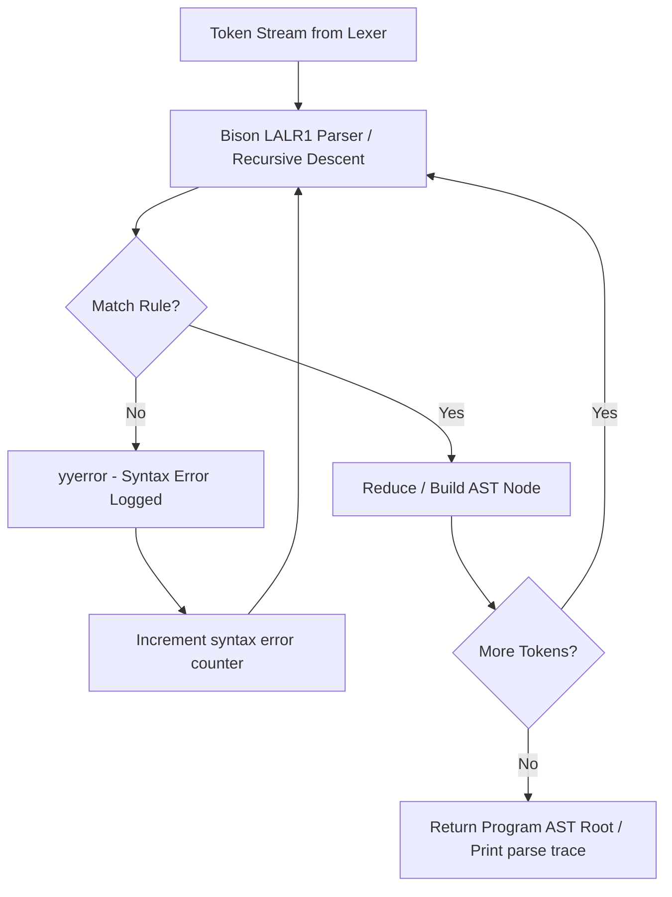

# Parser Design — PolyCompile

---

## 1. Overview

PolyCompile provides **three Bison LALR(1) parsers**, one per language:

| Parser File | Language | Grammar Type |
|-------------|----------|-------------|
| `compiler/c/parser/parser_c.y` | C | LALR(1) via Bison |
| `compiler/cpp/parser/parser_cpp.y` | C++ | LALR(1) via Bison |
| `compiler/java/parser/parser_java.y` | Java | LALR(1) via Bison |

Each parser is the **standalone Flex/Bison deliverable** (produces `test_c.exe`, `test_cpp.exe`, `test_java.exe`). The unified C++ compiler pipeline additionally uses hand-built recursive-descent parsers in the `Frontend_*.cpp` files that produce the shared `ASTBase` tree.

---

## 2. Parser Architecture

### 2.1 Dual-Parser Architecture

PolyCompile uses two complementary parsing approaches:

| Parser Type | Used For | Output |
|-------------|----------|--------|
| **Bison LALR(1)** | Standalone `test_*.exe` deliverables | Parse trace printed to stdout |
| **C++ Recursive Descent** | `polycompile.exe` main pipeline | `ASTNodePtr` tree (ASTBase.hpp nodes) |

The Bison parsers are lab deliverables for demonstrating formal grammar parsing. The recursive-descent parsers in `Frontend_C.cpp`, `Frontend_CPP.cpp`, and `Frontend_Java.cpp` drive the full compilation pipeline.

---

## 3. Grammar Start Symbol

All three parsers use:
```bison
%start program
```

---

## 4. Operator Precedence Declarations (C Parser)

Declared using Bison `%left` / `%right` directives — lowest to highest precedence:

```bison
%right ASSIGN OP_PLUS_ASSIGN OP_MINUS_ASSIGN OP_MUL_ASSIGN OP_DIV_ASSIGN
%left  OP_OR
%left  OP_AND
%left  OP_EQ OP_NEQ
%left  '<' '>' OP_LEQ OP_GEQ
%left  '+' '-'
%left  '*' '/' '%'
%right '!' OP_INC OP_DEC
%left  LPAREN RPAREN LBRACKET RBRACKET
```

This mirrors standard C operator precedence and resolves all shift-reduce conflicts related to operators.

---

## 5. Conflict Resolution

### 5.1 Dangling Else Problem

The classic `if`-`else` dangling-else ambiguity:
```
if (a) if (b) S1 else S2
```
Is resolved by Bison's **default shift-over-reduce rule**, which correctly associates `else` with the nearest preceding `if`. This is the standard resolution and requires no explicit precedence declaration.

### 5.2 Expression Associativity

All binary arithmetic and comparison operators are declared `%left`, meaning:
```
a + b + c → (a + b) + c   ✓ (left-associative)
```

Assignment operators are declared `%right`, meaning:
```
a = b = c → a = (b = c)   ✓ (right-associative)
```

---

## 6. YYLVAL Union

Each parser declares a value union for semantic actions:

```bison
%union {
    char* string_val;   /* raw lexeme text */
}
```

All non-terminals that carry a value (identifiers, type names, expression strings) are typed as `<string_val>`.

---

## 7. Error Reporting

All parsers define a `yyerror()` function:

```c
void yyerror(const char* msg) {
    fprintf(stderr, "[Syntax Error] Line %d: %s (near '%s')\n",
            c_line, msg, yytext);
    c_syntax_errors++;
}
```

A global counter (`c_syntax_errors`, `cpp_syntax_errors`, `java_syntax_errors`) accumulates the number of syntax errors found.

---

## 8. Grammar Rules Summary

### 8.1 Top-Level Rules (C Parser)

```
program           → declaration_list
declaration_list  → declaration | declaration_list declaration
declaration       → header_directive | function_definition | var_declaration
```

### 8.2 Expression Hierarchy

The expression grammar enforces precedence through layered non-terminals:

```
expression
  → assignment_expr
    → logical_or_expr
      → logical_and_expr
        → equality_expr
          → relational_expr
            → additive_expr
              → multiplicative_expr
                → unary_expr
                  → postfix_expr
                    → primary_expr
```

Each level handles a specific precedence band and delegates to the next.

### 8.3 Statement Rules

```
statement → var_declaration
          | expression_statement
          | compound_statement
          | if_statement
          | switch_statement
          | while_statement
          | do_while_statement
          | for_statement
          | printf_statement
          | scanf_statement
          | return_statement
          | break_statement
          | continue_statement
```

---

## 9. C++ Parser Additions

The C++ Bison parser extends the C grammar with:

```bison
/* C++ using directive */
using_directive : KEYWORD_USING KEYWORD_NAMESPACE IDENTIFIER SEMICOLON

/* cout stream output */
cout_statement  : KEYWORD_COUT cout_chain SEMICOLON
cout_chain      : STREAM_OUT cout_arg | cout_chain STREAM_OUT cout_arg
cout_arg        : expression | KEYWORD_ENDL

/* cin stream input */
cin_statement   : KEYWORD_CIN cin_chain SEMICOLON
cin_chain       : STREAM_IN IDENTIFIER | cin_chain STREAM_IN IDENTIFIER
```

Additional stream operators `<<` (`STREAM_OUT`) and `>>` (`STREAM_IN`) are returned by the C++ lexer.

---

## 10. Java Parser Additions

The Java Bison parser supports:

```bison
/* Top-level class structure */
program         : class_declaration
class_declaration : modifiers KEYWORD_CLASS IDENTIFIER LBRACE class_body RBRACE
class_body      : class_member | class_body class_member
class_member    : method_definition | field_declaration

/* Modifiers */
modifiers       : /* empty */ | modifiers modifier
modifier        : KEYWORD_PUBLIC | KEYWORD_PRIVATE | KEYWORD_PROTECTED
               | KEYWORD_STATIC | KEYWORD_FINAL | KEYWORD_ABSTRACT

/* System.out.println / System.out.print */
println_stmt    : IDENTIFIER DOT IDENTIFIER DOT IDENTIFIER LPAREN argument_list RPAREN SEMICOLON
                | IDENTIFIER DOT IDENTIFIER DOT IDENTIFIER LPAREN RPAREN SEMICOLON
```

---

## 11. Parser Flow Diagram



---

## 12. Standalone Parser Usage

The Bison parsers can be built and run independently:

```bash
# Build standalone C parser
make test-fb-c
./test_c.exe examples/hello.c

# Build standalone C++ parser
make test-fb-cpp
./test_cpp.exe examples/hello.cpp

# Build standalone Java parser
make test-fb-java
./test_java.exe examples/Hello.java
```

Output is a trace of all recognized grammar rules, printed to stdout, for example:
```
[Token] Header directive: #include <stdio.h>
[Param] (none)
[Func] Function: int main()
[Decl] Variable: int number
[Stmt] printf(...)
[Stmt] scanf(...)
[Stmt] if (==_expr)
[Stmt] return 0
[Parse] C program parsed successfully.
[OK] Parsed successfully with 0 syntax errors.
```
