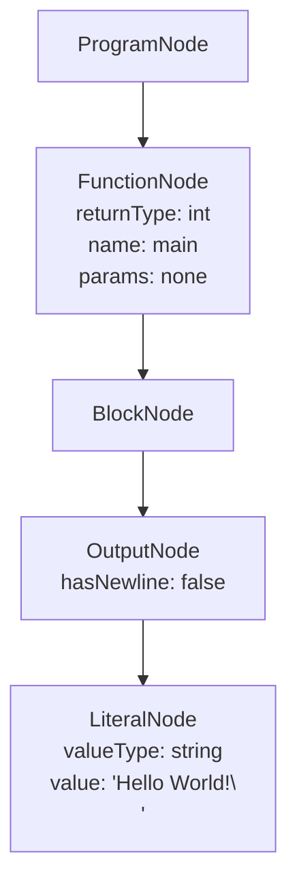
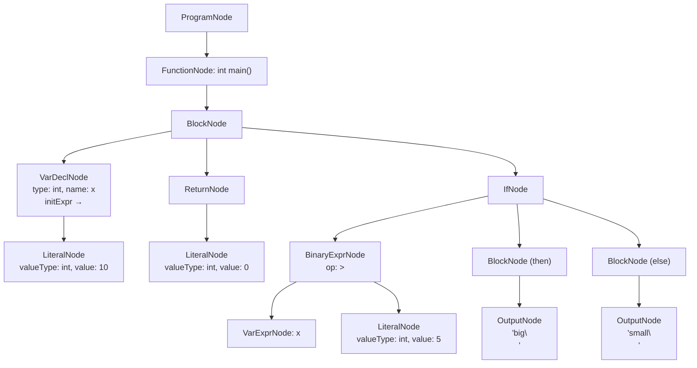
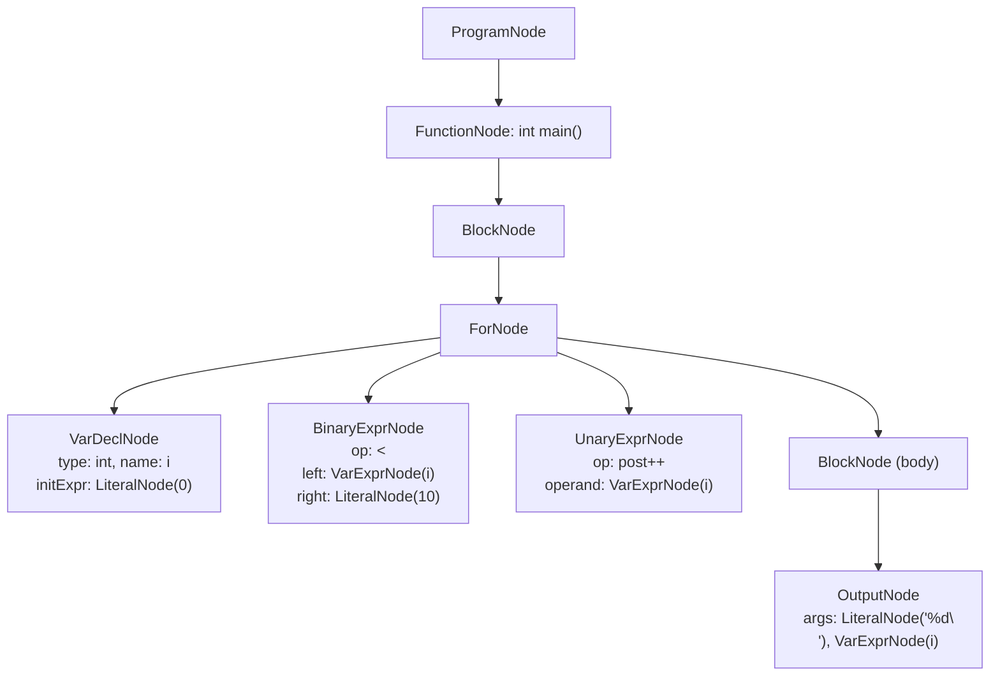
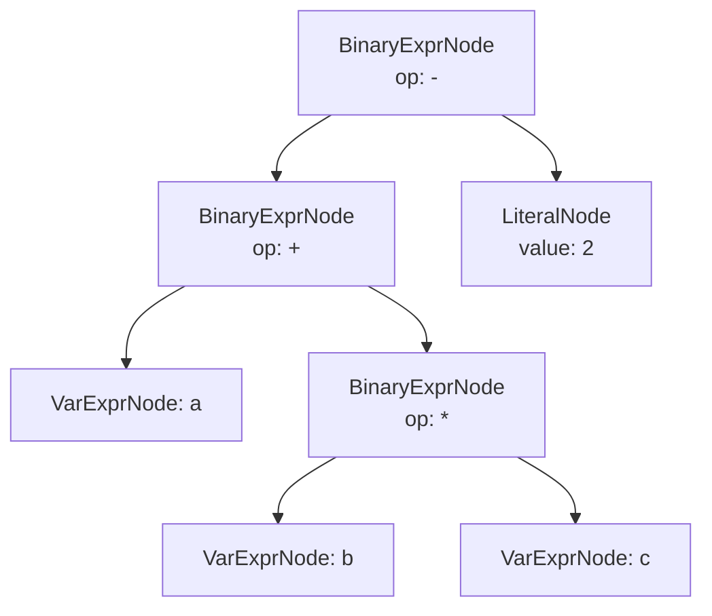

# AST Example Diagram

## Example 1: Hello World (C)

**Source:**
```c
#include <stdio.h>
int main() {
    printf("Hello World!\n");
}
```

**AST Structure:**


---

## Example 2: If-Else Statement (C)

**Source:**
```c
int main() {
    int x = 10;
    if (x > 5) {
        printf("big\n");
    } else {
        printf("small\n");
    }
    return 0;
}
```

**AST Structure:**


---

## Example 3: For Loop

**Source:**
```c
int main() {
    for (int i = 0; i < 10; i++) {
        printf("%d\n", i);
    }
}
```

**AST Structure:**


---

## Example 4: Binary Expression Tree

**Source expression:** `a + b * c - 2`

**Parse tree (showing precedence):**


This correctly represents `(a + (b * c)) - 2` due to precedence rules (`*` binds tighter than `+`, which binds tighter than `-`).

---

## Node Type Reference

| Node Class | `ASTNodeType` | Purpose |
|------------|---------------|---------|
| `ProgramNode` | `PROGRAM` | Root of the entire AST |
| `FunctionNode` | `FUNCTION` | Function definition |
| `VarDeclNode` | `VAR_DECL` | Single variable declaration |
| `VarDeclListNode` | `VAR_DECL_LIST` | `int a, b, c;` |
| `BlockNode` | `BLOCK` | `{ ... }` compound statement |
| `IfNode` | `IF_STMT` | if / if-else |
| `SwitchNode` | `SWITCH_STMT` | switch/case/default |
| `WhileNode` | `WHILE_STMT` | while loop |
| `DoWhileNode` | `DO_WHILE_STMT` | do-while loop |
| `ForNode` | `FOR_STMT` | for loop |
| `ReturnNode` | `RETURN_STMT` | return statement |
| `BreakNode` | `BREAK_STMT` | break statement |
| `ContinueNode` | `CONTINUE_STMT` | continue statement |
| `AssignNode` | `ASSIGN_STMT` | Assignment (=, +=, -=, ...) |
| `BinaryExprNode` | `BINARY_EXPR` | Two-operand expression |
| `UnaryExprNode` | `UNARY_EXPR` | One-operand expression (!, -, ++, --) |
| `LiteralNode` | `LITERAL_EXPR` | Integer, float, string, char, bool constant |
| `VarExprNode` | `VAR_EXPR` | Variable reference in expression |
| `CallExprNode` | `CALL_EXPR` | Function call |
| `InputNode` | `INPUT_STMT` | scanf / cin / Scanner.nextInt() |
| `OutputNode` | `OUTPUT_STMT` | printf / cout / System.out.println() |
