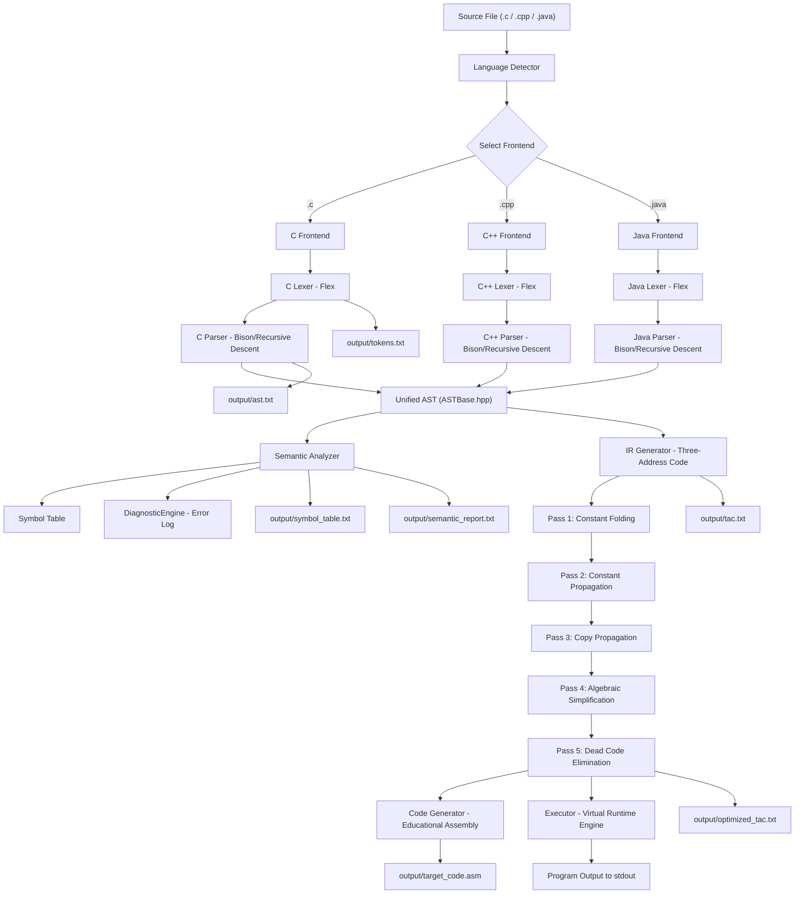

# Compiler Pipeline Diagram

## Pipeline Phase Summary

| Phase | Input | Output | Key Component |
|-------|-------|--------|--------------|
| 1. Lexical Analysis | Source characters | Token stream | `lexer_*.l` (Flex) |
| 2. Syntax Analysis | Tokens | AST | `parser_*.y` (Bison) / Recursive Descent |
| 3. Semantic Analysis | AST | Symbol Table + Error List | `Semantic_*.cpp` |
| 4. IR Generation | AST | TAC instructions | `IRGenerator.cpp` |
| 5. Optimization | TAC | Optimized TAC | `Optimizer.cpp` |
| 6a. Code Generation | Optimized TAC | Educational Assembly | `CodeGenerator.cpp` |
| 6b. Execution | Optimized TAC | Program Output | `Executor.cpp` |
