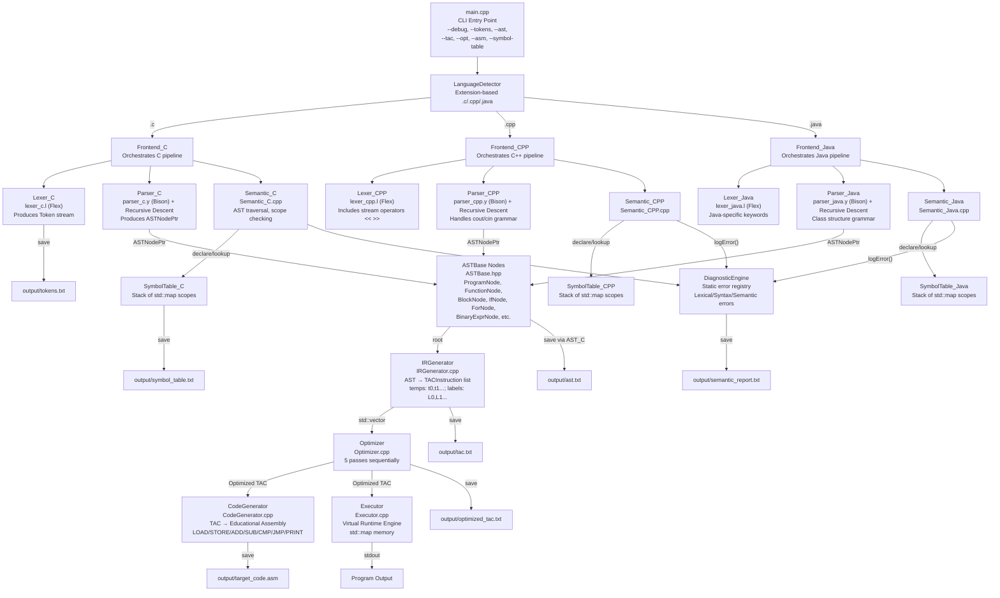

# Module Interaction Diagram

## Key Interfaces

| Interface | Type | Connects |
|-----------|------|---------|
| `ASTNodePtr` | `shared_ptr<ASTNode>` | Parser → Semantic Analyzer, Parser → IR Generator |
| `std::vector<Token>` | Token list | Lexer → Parser |
| `std::vector<TACInstruction>` | TAC list | IR Generator → Optimizer → CodeGenerator / Executor |
| `std::vector<std::string>` | Assembly lines | CodeGenerator → output file |
| `SymbolTable_*::lookup()` | `SymbolX*` | Semantic → Symbol Table |
| `DiagnosticEngine::logSemanticError()` | `void` | Any phase → Error registry |
