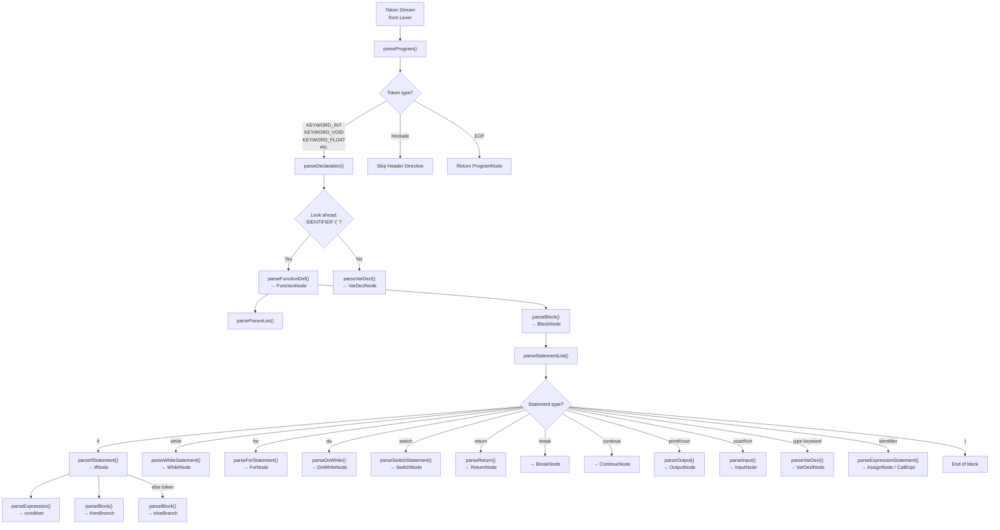
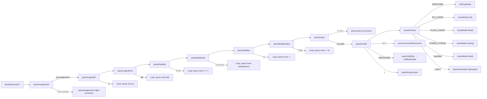
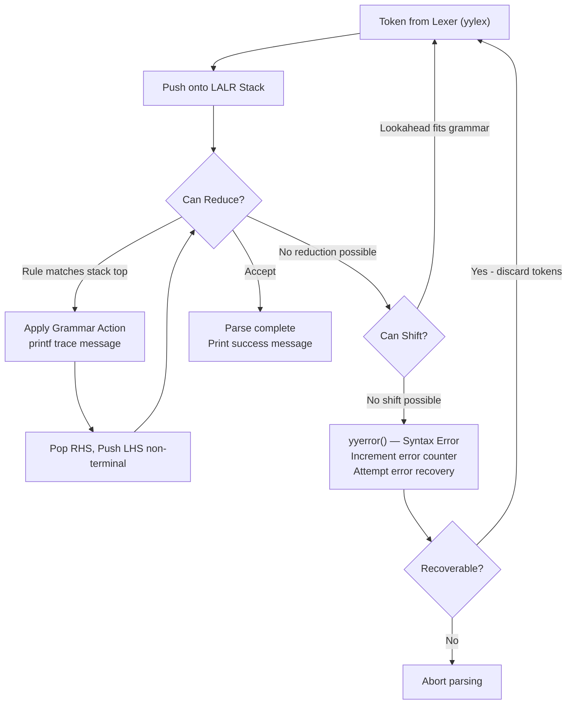

# Parser Flow Diagram

## 1. Recursive Descent Parser Flow (Main Pipeline)



---

## 2. Expression Parsing Hierarchy (Precedence Climbing)



---

## 3. Bison LALR(1) Parser Flow (Standalone Deliverable)



---

## 4. Error Recovery

The Bison parsers use Bison's built-in `error` recovery token. When a syntax error is encountered:

1. `yyerror()` is called — prints `[Syntax Error] Line N: message (near 'token')`
2. The error counter is incremented
3. Bison attempts to synchronize by discarding tokens until it finds a recovery point (typically `;` or `}`)
4. Parsing continues from the recovery point

At the end of parsing:
```
[OK] Parsed successfully with 0 syntax errors.
```
or:
```
[FAIL] 2 syntax error(s) found.
```
